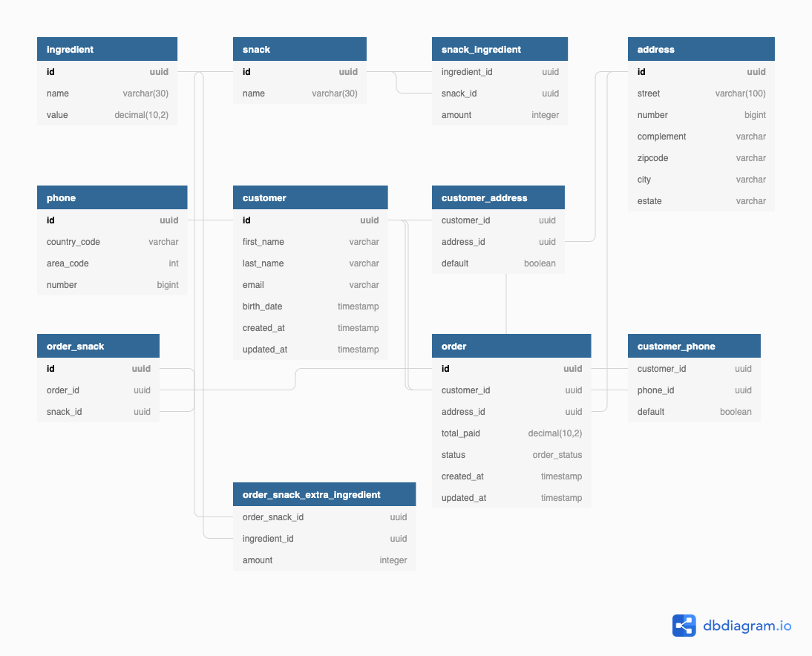

# Snack-api-service
Uma api que permite pequenos empresários a criar um serviço de delivery.

# Compilando e executando
Para compilar, entrar na pasta raiz e:
`mvn clean install`

Para executar é necessário docker, docker-compose:
`docker-compose up --build`

### Modelo de domínio da aplicação
O modelo de domínio da aplicaçao foi desenhado de acordo com o requisitos enumerados e pode ser visto na imagem:


### Endpoints
Para navegar pelos endpoints disponíveis existe uma colection/environment do Postman [aqui](doc/)

Listar lanches disponiveis: `curl --location --request GET 'http://localhost:8080/snacks/'`

Listar Adicionais disponíveis: `curl --location --request GET 'http://localhost:8080/ingredients'`

Listar clientes: `curl --location --request GET 'http://localhost:8080/customers/'`

Criar cliente: 
```
curl --location --request POST 'http://localhost:8080/customers/' \
                 --header 'Content-Type: application/json' \
                 --data-raw '{
                 	"primeiro_nome": "Ana Maria",
                 	"ultimo_nome": "Silveira",
                 	"email": "anamaria@gmail.com",
                 	"aniversario": "2001-02-01"
                 }' 
```

Criar endereço para um cliente:
```
curl --location --request POST 'http://localhost:8080/customers/4df5b9a5-52a4-47ab-a9b3-0874aa0b29bb/addresses' \
--header 'Content-Type: application/json' \
--data-raw '{
	"rua": "Rua teste",
	"numero": 1,
	"cep": "04532-123",
	"cidade": "Sao Paulo",
	"estado": "SP",
	"complemento": "alskdjflakdjsflkasdjf",
	"padrao": true
}'
```

Criar um pedido para um cliente:
```
curl --location --request POST 'http://localhost:8080/orders/customers/4df5b9a5-52a4-47ab-a9b3-0874aa0b29bb/addresses/63b2ff11-306d-4641-80f9-7e07fd53f81e' \
--header 'Content-Type: application/json' \
--data-raw '{
	"items": [
		{
			"lanche": "20d19704-07a8-483c-91f2-2567e52c9dd4",
			"quantidade": 4
		}
	]
}'
```

Criar um pedido para um cliente com entrega no endereço padrão:

```
curl --location --request POST 'http://localhost:8080/orders/customers/4df5b9a5-52a4-47ab-a9b3-0874aa0b29bb/' \
--header 'Content-Type: application/json' \
--data-raw '{
	"items": [
		{
			"lanche": "20d19704-07a8-483c-91f2-2567e52c9dd4",
			"quantidade": 2,
			"adicionais": [
				{
					"id": "22a5c95c-183b-4021-8774-4f7a2954cff6",
					"quantidade": 2
				},
				{
					"id" : "4d79d3eb-ae97-40cc-8bd8-6ab3c2836bc7",
					"quantidade": 3
				}
			]
		}
	]
}'
```

Atualizar status de um pedido:

```
curl --location --request PATCH 'http://localhost:8080/orders/e373083f-8e30-4159-9c29-01bd83af614d/status/PREPARING'
```

Cirar um pedido personalizado:

```
curl --location --request POST 'http://localhost:8080/orders/customers/4df5b9a5-52a4-47ab-a9b3-0874aa0b29bb/addresses/63b2ff11-306d-4641-80f9-7e07fd53f81e' \
--header 'Content-Type: application/json' \
--data-raw '{
	"items": [
		{
			"lanche": "5338b61c-16c2-4ec1-af8f-72a3333443eb",
			"quantidade": 2,
			"adicionais": [
				{
					"id": "22a5c95c-183b-4021-8774-4f7a2954cff6",
					"quantidade": 2
				},
				{
					"id" : "4d79d3eb-ae97-40cc-8bd8-6ab3c2836bc7",
					"quantidade": 3
				},
				{
					"id": "d19a9e2f-a032-481f-af39-ab8b0be82737",
					"quantidade": 2
				}
			]
		},
		{
			"lanche": "20d19704-07a8-483c-91f2-2567e52c9dd4",
			"quantidade": 4
		}
	]
}'
```

Criar um pedido no endereço padrão na promoçao hamburger:

```
curl --location --request POST 'http://localhost:8080/orders/customers/4df5b9a5-52a4-47ab-a9b3-0874aa0b29bb/' \
--header 'Content-Type: application/json' \
--data-raw '{
	"items": [
		{
			"lanche": "5338b61c-16c2-4ec1-af8f-72a3333443eb",
			"quantidade": 1,
			"adicionais": [
				{
					"id": "f960c601-d460-4bd2-be5b-93b114d9118a",
					"quantidade": 2
				},
				{
					"id": "d19a9e2f-a032-481f-af39-ab8b0be82737",
					"quantidade": 6
				}
			]
		}
	]
}'
```